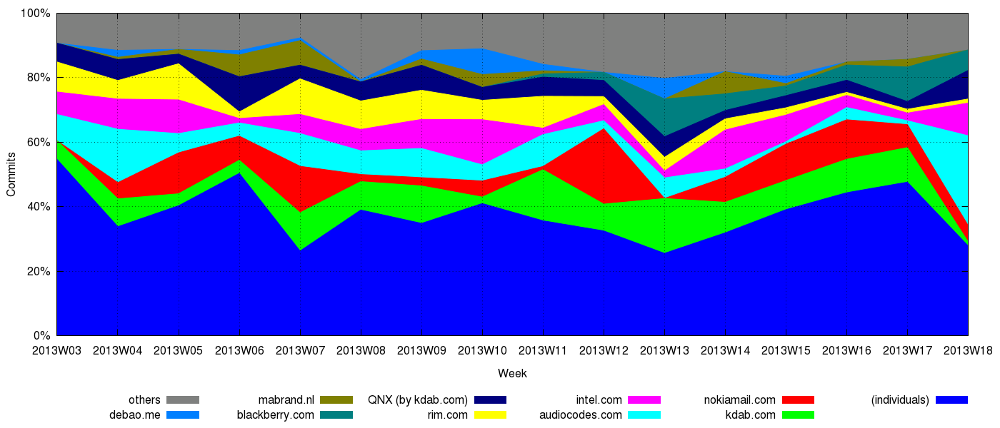
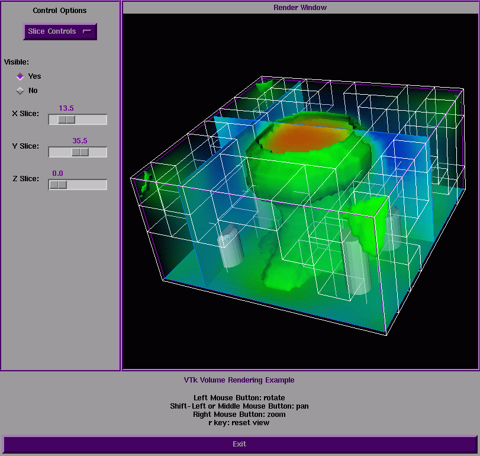

# SharkLib
I want share my experience to every one who want to learn
 - Qt
 - VTK
 - Python
 
It includes 4 parts, one is the basic knowledge of Qt, and another is how to use VTK in Qt.

[Qt](https://en.wikipedia.org/wiki/Qt_(software)) is a great liabrary to implement C++ software cross platform, once you finished your implement, you are ability to compile application for Windows, Mac, Linux, even Android and iOS.

[VTK](https://vtk.org/Wiki/VTK)  is an open source, freely available software system for 3D computer graphics, image processing, and visualization used by thousands of researchers and developers around the world. VTK consists of a C++ class library, and several interpreted interface layers including Python, Tcl/Tk and Java. Professional support and products for VTK are provided by Kitware, Inc. VTK supports a wide variety of visualization algorithms including scalar, vector, tensor, texture, and volumetric methods; and advanced modeling techniques such as implicit modelling, polygon reduction, mesh smoothing, cutting, contouring, and Delaunay triangulation. In addition, dozens of imaging algorithms have been directly integrated to allow the user to mix 2D imaging / 3D graphics algorithms and data.

In Qt course, I will teach how to Learn Qt in 21 Days step by step.. 

 - Course One - 
  Setup your computer.
 - Course Two - The first Qt Widget Application

In VTK course, I will teach how to implement VTK in 21 Days step by step.. 

 - Course One - Setup your computer.
 - Course Two - The first VTK Application - [Cone Application](https://sharklib.github.io/vtk/2020/01/02/vtk-course2.html)
 

 - Course 3 - The first VTK Application - [Cone Application](https://sharklib.github.io/vtk/2020/01/02/vtk-course3.html)
 
 
 
 - Course 4 - The first VTK Application - [Cone Application](https://sharklib.github.io/vtk/2020/01/02/vtk-course4.html)
 
 
 
In Python course, I will teach how to implement VTK in 21 Days step by step.. 

 - Course One - Setup your computer.
 - Course Two - The first Python program
 
