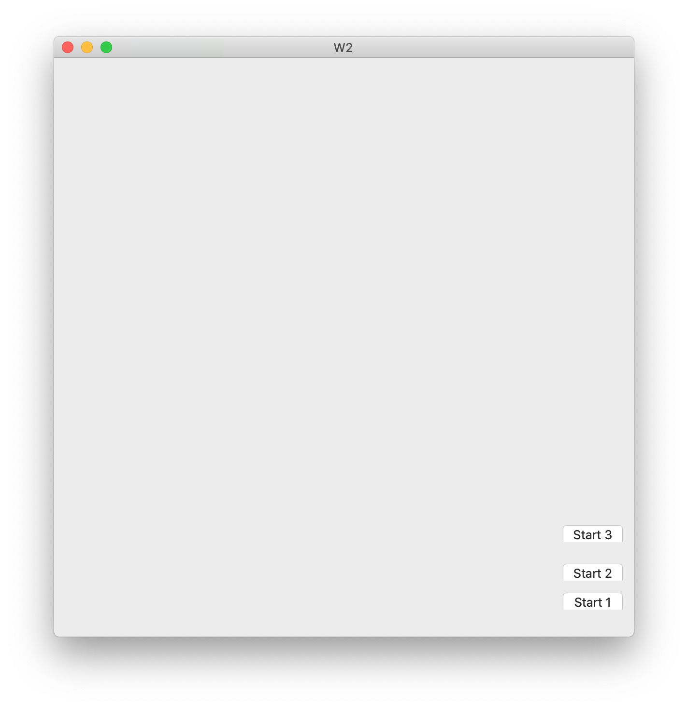
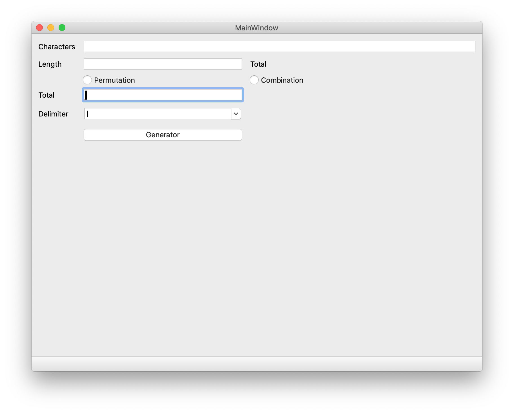

# SharkLib
I want share my experience to every one who want to learn
 - Qt
 - VTK
 - Python
 
It includes 4 parts, one is the basic knowledge of Qt, and another is how to use VTK in Qt.

[Qt](https://en.wikipedia.org/wiki/Qt_(software)) is a great liabrary to implement C++ software cross platform, once you finished your implement, you are ability to compile application for Windows, Mac, Linux, even Android and iOS.

[VTK](https://vtk.org/Wiki/VTK)  is an open source, freely available software system for 3D computer graphics, image processing, and visualization used by thousands of researchers and developers around the world. VTK consists of a C++ class library, and several interpreted interface layers including Python, Tcl/Tk and Java. Professional support and products for VTK are provided by Kitware, Inc. VTK supports a wide variety of visualization algorithms including scalar, vector, tensor, texture, and volumetric methods; and advanced modeling techniques such as implicit modelling, polygon reduction, mesh smoothing, cutting, contouring, and Delaunay triangulation. In addition, dozens of imaging algorithms have been directly integrated to allow the user to mix 2D imaging / 3D graphics algorithms and data.

In Qt course, I will teach how to Learn Qt in 21 Days step by step.. 

 - Course One - Setup your computer.
   Now Qt has binary version, it is easy to insall Qt to windows, Mac and Linux. 
   - 1 Download [Qt](qt.io) choose the right version.
   - 2 Open the binary file and fellow the steps.
   - 3 If want to intergrate it with VS, please download the qt_plugin for VS.
   
 - Course Two - [A Dialog Application]()
  - Open Qt Create, choose "New Project" from "File" menu.
  - In first step, choose Application -> Qt Widgets Application
  - In 3rd step, change base class from QMainWindow to QDialog.
  - After Done, click Run button.
  Now you get one dialog application:
  If you want to change the GUI, using Qt Designer or the Qt Creator, you can add/delete/modify your UI as other IDE.
  
  
  - Course 3 - [MainWidow Application]()
    - Open Qt Create, choose "New Project" from "File" menu.
  - In first step, choose Application -> Qt Widgets Application
  - In 3rd step, Not change Anything only the class name.
  - After Done, click Run button.
  Now you get one dialog application:
    If you want to change the GUI, using Qt Designer or the Qt Creator, you can add/delete/modify your UI as other IDE.
  
 
 - Course 4 - [Custom MainWidow]()
  - 1 Add menu
  - 2 Add Status Bar
  - 3 Add ToolBar
  - 4 Using Dock widget

 
 - Course [Draw Sharp](https://github.com/SharkLib/SharkLib/tree/master/Qt/CustomDraw)
 
 
  | 
  |
||

In VTK course, I will teach how to implement VTK in 21 Days step by step.. 

 - Course One - [Setup your computer.](https://sharklib.github.io/vtk/2020/01/01/vtk-course1.html)

  
 - Course Two - [Cone Application](https://sharklib.github.io/vtk/2020/01/02/vtk-course2.html) - 
 [Source Code](https://github.com/SharkLib/SharkLib/tree/master/VTK/Course1)
 

 - Course 3 - [Cone_Outline Application](https://sharklib.github.io/vtk/2020/01/03/vtk-course3.html) - [Source Code](https://github.com/SharkLib/SharkLib/tree/master/VTK/Course2)
 
 
 
 - Course 4 - [Cone_Axis Application](https://sharklib.github.io/vtk/2020/01/04/vtk-course4.html) - [Source Code](https://github.com/SharkLib/SharkLib/tree/master/VTK/Course3)
 
 

  - Course 5 - [Cone_Box Application](https://sharklib.github.io/vtk/2020/01/04/vtk-course5.html) - [Source Code](https://github.com/SharkLib/SharkLib/tree/master/VTK/Course4)
 
 

  - Course 6 - [Cube Application - Custom data](https://sharklib.github.io/vtk/2020/01/04/vtk-course6.html) - [Source Code](https://github.com/SharkLib/SharkLib/tree/master/VTK/Course4)
 
In Python course, I will teach how to implement VTK in 21 Days step by step.. 

 - Course One - Setup your computer.
 - Course Two - The first Python program
 
